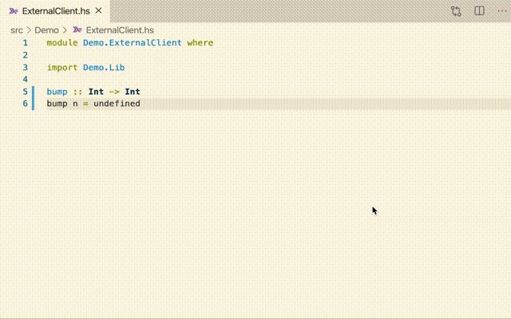

# LiquidHaskell as a GHC Plugin

This repo demonstrates how to use [LiquidHaskell](https://github.com/ucsd-progsys/liquidhaskell) as a GHC plugin.

Specifically, it shows how we use the liquid type specifications written 
for functions defined in the [lh-plugin-demo package](https://github.com/ucsd-progsys/lh-plugin-demo/) 
in client packages.

For details see the files

* [stack.yaml](stack.yaml)

* [cabal.project](cabal.project)

Here's a VSCode screenshot 

